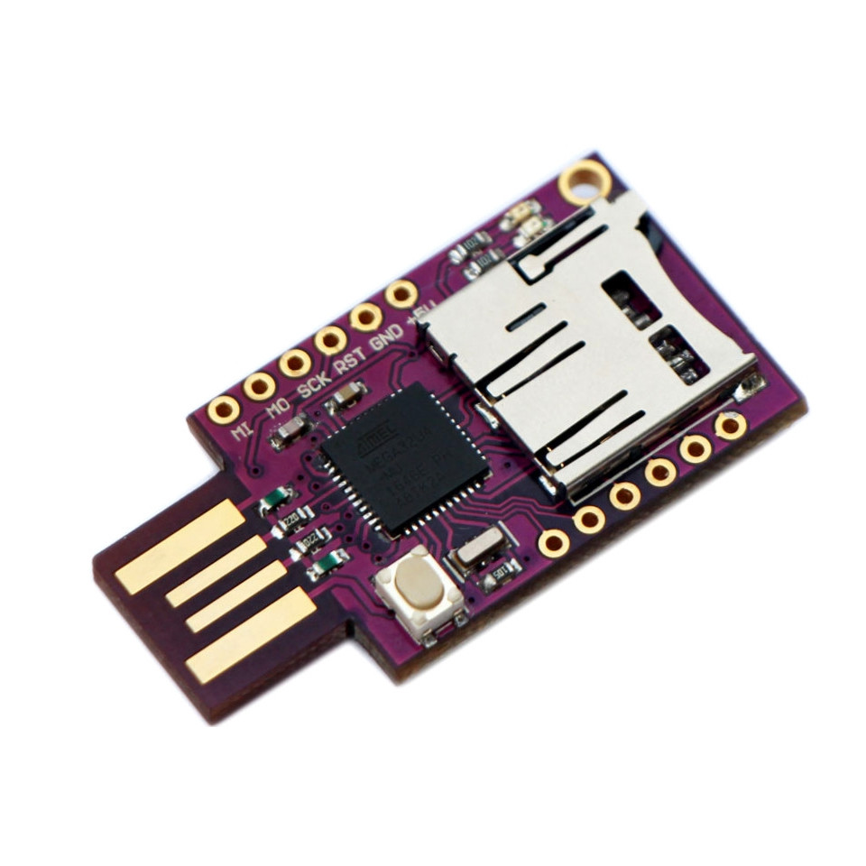

Rubber Ducky script interpreter
===============================
 
This code run Rubber Ducky scripts directly in cheap Atmega32u4 + microsd boards just copying to microSD as script.txt.
Also works in any Arduino Leonardo (original or clone) + SD board,please keep in mind connect CS pin to digital 4 or modify this code.



WARNING: you must install [this custom version of Arduino Keyboard library]https://github.com/ernesto-xload/arduino_keyboardlib

Download and installation
=========================
- Click "Clone or download" -> "Download ZIP"
- Unzip downloaded file when you want to work.
- Open Arduino IDE
- Open ducky_interpreter.ino file
- Select Arduino Leonardo board
- Plug the board to your computer
- Upload the code to the board

Use
===
- Rename your favorite Rubber Ducky script to script.txt at microsd card
- Insert microsd card at your board
- Hack & fun! ;)

Version History
===============
```
(Date format: DD/MM/YYYY)
* 24/8/2017 First commit

```

TO DO
=====
Some functions like:
- NUMLOCK
- SCROLLLOCK
- DEFAULT_DELAY DEFAULTDELAY

Contact
=======
Open an issue, ask me on twitter to [@ernesto_xload](http://www.twitter.com/ernesto_xload/) or visit www.sanchezpano.info
